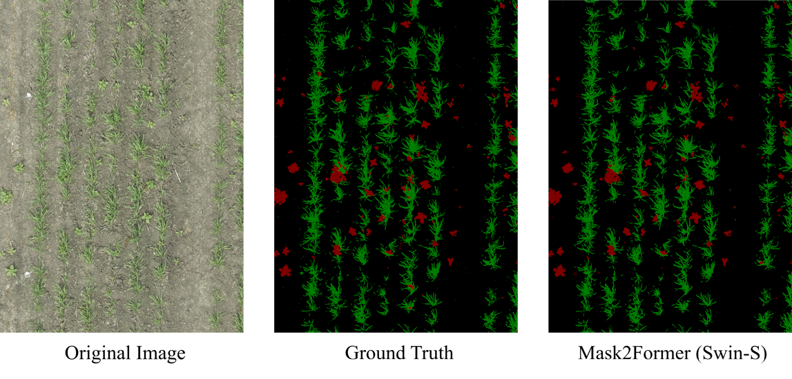

# Semantic Segmentation of Weeds in Wheat Fields: Commercial vs Custom Models



## Custom Model Implementation

This implementation of Mask2Former is forked from the official implementation by Facebook AI Research: https://github.com/facebookresearch/Mask2Former.

Also see the [original Mask2Former project README](MASK2FORMER_README.md).

### Dataset

The Nassar 2020 dataset can be downloaded [here](https://www.kaggle.com/datasets/yueminwang/nassar-2020?resource=download).

### Installation:

See the [Mask2Former installation instructions](INSTALL.md).

### Usage:

#### Training:

Train a new model on the Nassar 2020 dataset:

```
python train_net.py --config-file configs/nassar2020/semantic-segmentation/<config file .yaml> --num-gpus <num-gpus>
```

#### Inference:

Perform inference on all image files in the `inference/input` directory using a trained model. Segmentation masks are output in the `inference/output` directory.

```
python ./demo/demo.py --config-file ./configs/nassar2020/semantic-segmentation-eval/<config file .yaml> --input ./inference/input/!(README.md) --output ./inference/output
```

#### ResNet-50:

```
python ./demo/demo.py --config-file ./configs/nassar2020/semantic-segmentation-eval/resnet_50.yaml --input ./inference/input/!(README.md) --output ./inference/output
```

#### ResNet-101:

```
python ./demo/demo.py --config-file ./configs/nassar2020/semantic-segmentation-eval/resnet_101.yaml --input ./inference/input/!(README.md) --output ./inference/output
```

#### Swin-T:

```
python ./demo/demo.py --config-file ./configs/nassar2020/semantic-segmentation-eval/swin/swin_t.yaml --input ./inference/input/!(README.md) --output ./inference/output
```

#### Swin-S:

```
python ./demo/demo.py --config-file ./configs/nassar2020/semantic-segmentation-eval/swin/swin_s.yaml --input ./inference/input/!(README.md) --output ./inference/output
```

#### Swin-B:

```
python ./demo/demo.py --config-file ./configs/nassar2020/semantic-segmentation-eval/swin/swin_b.yaml --input ./inference/input/!(README.md) --output ./inference/output
```

### Pretrained Models:

Trained models for each of the backbones used in our experiment can be downloaded [here](https://usaskca1-my.sharepoint.com/:f:/g/personal/pef702_usask_ca/EmFT-Cw_84NNifogGrUL-KwBv2_XMJCIax_LcgfG4o9pVA?e=B4AQEA). They are to be put in the corresponding directory in `src/Mask2Former/pretrain`.

| Backbone   | Size   | mIoU  |
| ---------- | ------ | ----- |
| ResNet-50  | 0.52GB | 88.38 |
| ResNet-101 | 0.74GB | 89.11 |
| Swin-T     | 0.55GB | 89.39 |
| Swin-S     | 0.81GB | 90.09 |
| Swin-B     | 1.25GB | 89.95 |
